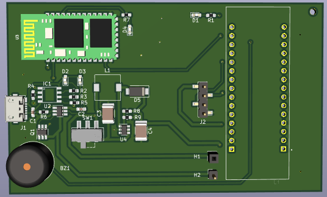
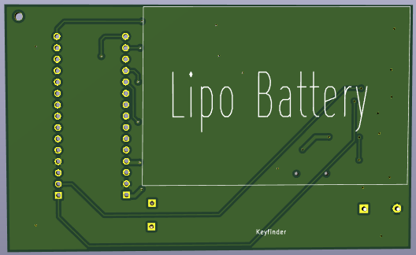
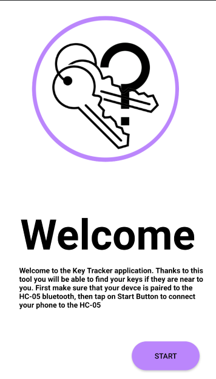
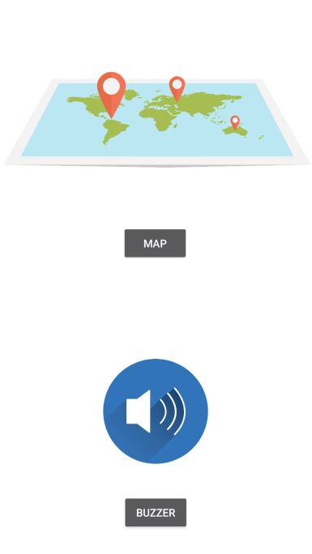

# Key Tracker

The goal of this project is to design a small embedded device that you can attach to your key in order to find them when they are lost.

## How it work

On the board which is attach to your key you have nucleo board which communicate with a GPS and Send the Location of the key to a mobile application thanks to a Bluetooth Module.
You can also detect the location of the key by making sound the buzzer.

                                    TOP

                                     BOTTOM

            Application Welcome page

            Application choice page